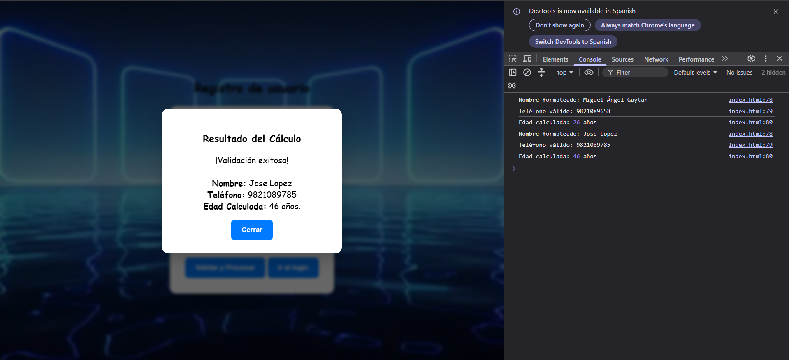
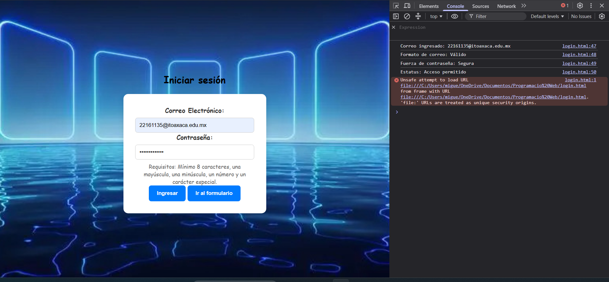

# Librería de Validaciones JS

### TECNOLÓGICO NACIONAL DE MÉXICO/
### INTITUTO TECNOLÓGICO DE OAXACA

#### Estudiante: Macuixtle Gaytán Miguel Angel
#### Materia: Programación Web
#### Docente: Martinez Nieto Adelina
#### Unidad: 2
#### Actividad 2: Libreria Utileria .js
#### Fecha: 04/07/2026

## ¿Qué problema resuelve?
Al desarrolar aplicaciones web, la captura errónea de datos por parte de los usuarios (como correos mal escritos, nombres en minúsculas o fechas de nacimiento irreales) puede provocar fallos en las bases de datos y generar errores en la lógica de negocio. 

Esta librería se encarga de la validación de formularios, ofreciendo un conjunto de funciones puras, limpias y reutilizables que garantizan que la información sea correcta antes de ser procesada o almacenada.

---

## Instalación

La librería no requiere dependencias externas ni frameworks. Para implementarla, simplemente descarga el archivo `utileria.js` y vincúlalo en tu documento HTML justo antes del cierre de la etiqueta `<body>` o dentro de tu `<head>`:

```html
<script src="js/utileria.js"></script>
```

---

## Uso y ejemplos de código

La librería consta de 8 funciones puras. A continuación se muestra cómo implementar cada una en la lógica de tu formulario:

### 1. `validarCorreo(correo)`
Utiliza expresiones regulares para confirmar que el formato de email sea válido.
```javascript
let correo = "usuario@dominio.com";
if (!validarCorreo(correo)) {
    alert("Error: Introduce un correo electrónico válido.");
}
```

### 2. `soloLetras(texto)`
Asegura que una cadena no contenga números ni caracteres especiales.
```javascript
let nombreLimpio = "Miguel Angel";
if (!soloLetras(nombreLimpio)) {
    alert("Error: El nombre solo debe contener letras y espacios.");
}
```

### 3. `validarLongitud(numero, maxLongitud)`
Verifica de forma estricta la cantidad de caracteres de un dato (ideal para teléfonos).
```javascript
let telefono = "9511234567";
if (!validarLongitud(telefono, 10)) {
    alert("Error: El teléfono debe tener exactamente 10 dígitos.");
}
```

### 4. `calcularEdad(fechaNacimiento)`
Calcula la edad exacta del usuario al día de hoy tomando en cuenta meses y días.
```javascript
let miEdad = calcularEdad("2005-10-15");
console.log(`El usuario tiene ${miEdad} años cumplidos.`);
```

### 5. `esMayorDeEdad(fechaNacimiento)`
Devuelve un valor booleano (true/false) para saber si el usuario cumple con la mayoría de edad (18+).
```javascript
if (!esMayorDeEdad("2010-05-10")) {
    alert("Acceso denegado: Debes ser mayor de edad para registrarte.");
}
```

### 6. `validarPassword(password)`
Fuerza la creación de contraseñas seguras (mínimo 8 caracteres, mayúsculas, minúsculas, números y símbolos).
```javascript
let password = "Password123@";
if (!validarPassword(password)) {
    alert("Error: La contraseña es demasiado débil.");
}
```

### 7. `validarFechaLogica(fechaNacimiento)`
Bloquea fechas irreales (en el futuro o que den como resultado más de 120 años).
```javascript
let fecha = "2050-01-01";
if (!validarFechaLogica(fecha)) {
    alert("Error: La fecha de nacimiento no tiene sentido cronológico.");
}
```

### 8. `capitalizarNombres(nombreCompleto)`
Limpia y da formato de título a los nombres ingresados por el usuario.
```javascript
let entrada = "miguel angel macuixtle";
let nombreLimpio = capitalizarNombres(entrada);
console.log(nombreLimpio); // "Miguel Angel Macuixtle"
```
---
## Capturas de pantalla (Evidencia)

A continuación se muestra la librería en acción bloqueando datos inválidos y procesando un registro exitoso:

### Formulario


*Figura 1: La interfaz muestra el modal de éxito de captura de datos y la consola muestra que todo se guardo correctamente*

### Login


*Figura 2: La consola muestra que los datos son validos.*

---
## Video promocional

link del video en Drive:
